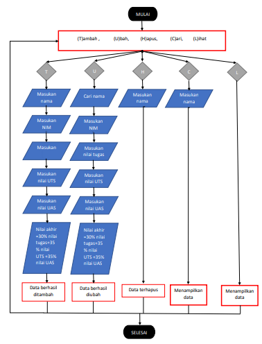
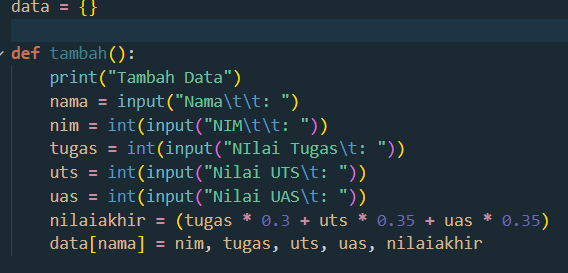

### Membuat Program daftar Nilai Mahasiswa dan Flowchartnya
### Ini Flowchartnya

### Begini Tutorialnya

Buat Variabel Global untuk menyimpan data Mahasiswa dan buat fungsi tambah untuk menambahkan data

Buat fungsi tampilkan unutk menampilkan data.

Buat funsi hapus untuk menghapus data berdasarkan nama.

Buat fungsi ubah untuk mengubah data berdasarkan nama.

Buat program menu untuk menampilkan semua fungsi yang telah dibuat mengggunakan while.

